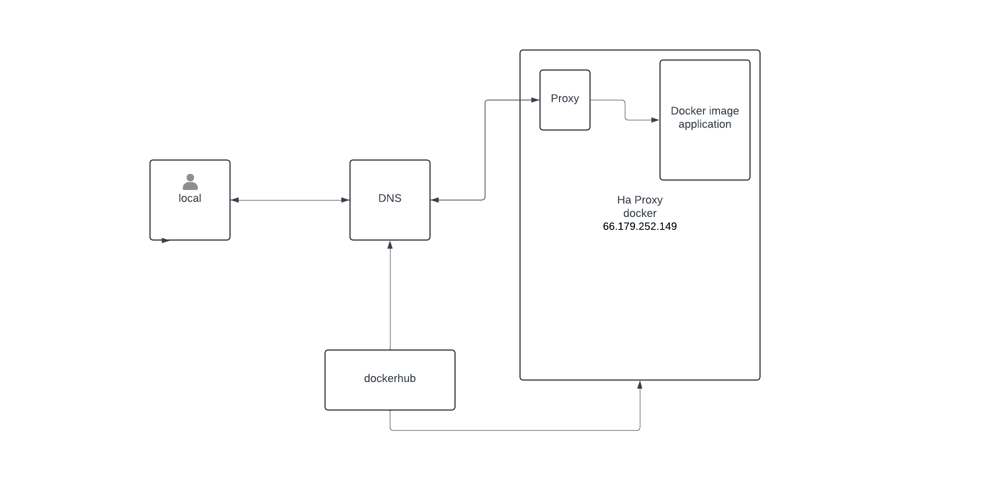

# Qsofte Website Development

[](LICENSE)

## Description



## Table of Contents

- [Setup Local Dev Environment](#setup-local-dev-environment)
- [Usage](#usage)
- [Contributing](#contributing)
- [License](#license)
- [Contact](#contact)


## Setup Local Dev Environment

1. **Prerequisites**:
    - **Install an IDE**: We recommend [VS Code](https://code.visualstudio.com/).
    - **Install Node.js**: Download and install it from [nodejs.org](https://nodejs.org/).
    - **Install Git**: Download and install Git from [git-scm.com](https://git-scm.com/).

2. **Steps**:

    1. Clone the repository:
        ```bash
        git clone <repository-link>
        ```
    2. Navigate to the repository directory:
        ```bash
        cd <repository-directory>
        ```
    3. Install npm dependencies:
        ```bash
        npm install
        ```
    4. Create a new branch:
        ```bash
        git checkout -b <branch-name>
        ```
    5. Make changes to the repository.

    6. Stage changes for commit:
        ```bash
        git add <file-name>
        ```
    7. Commit changes:
        ```bash
        git commit -m "Your commit message"
        ```
    8. Run the project:
        ```bash
        npm start
        ```
    9. Push changes to the remote repository:
        ```bash
        git push origin <branch-name>
        ```
    10. Create a pull request with the branch.

### Explanation of Commands

1. **Clone the repository**:
    ```bash
    git clone <repository-link>
    ```
    This command copies the remote repository to your local machine.

2. **Navigate to the repository directory**:
    ```bash
    cd <repository-directory>
    ```
    Changes the current directory to the repository directory.

3. **Install npm dependencies**:
    ```bash
    npm install
    ```
    Installs all the dependencies listed in the `package.json` file.

4. **Create a new branch**:
    ```bash
    git checkout -b <branch-name>
    ```
    Creates a new branch and switches to it.

5. **Make changes to the repository**: Modify the files as needed.

6. **Stage changes for commit**:
    ```bash
    git add <file-name>
    ```
    Adds the specified file(s) to the staging area, preparing them for a commit.

7. **Commit changes**:
    ```bash
    git commit -m "Your commit message"
    ```
    Commits the staged changes with a descriptive message.

8. **Run the project**:
    ```bash
    npm start
    ```
    Starts the application.

9. **Push changes to the remote repository**:
    ```bash
    git push origin <branch-name>
    ```
    Pushes the committed changes to the remote repository.

10. **Create a pull request**: Use GitHub or another Git hosting service to create a pull request from the new branch.

## Dockerize Node.js (React App)

1. **Create a Dockerfile**: Ensure you have an appropriate Dockerfile for your project.

2. **Build the Docker image**:
    ```bash
    ild --platform="linux/amd64" -tdocker bu qsofte:<version> .
    ```

    - Replace `<version>` with the version you are building, e.g., `v0.10`.

    This command is used to build a Docker image from a Dockerfile. Here's what each part of the command does:
    - `docker build`: This is the command to build a Docker image.
    - `--platform="linux/amd64"`: This option specifies the platform the Docker image is built for. In this case, it's built for Linux systems with AMD64 architecture.
    - `-t qsofte:<version>`: This option is used to tag the Docker image with a name and a version. In this case, the name of the image is `qsofte` and the version is `<version>`.
    - `.`: This specifies the build context, which is the location of the Dockerfile and any files that are being copied into the Docker image. In this case, it's the current directory.

3. **Tag the Docker image**:
    ```bash
    docker tag qsofte:<version> qsofte/qsofte:<version>
    ```

    - Replace `<version>` with your image version, e.g., `v0.10`.

4. **Push the Docker image to Docker Hub**:
    ```bash
    docker push qsofte/qsofte:<version>
    ```

    - Replace `<version>` with your image version, e.g., `v0.11`.

## Testing the Docker Image on a VPS Server

1. **SSH into your VPS and sudo**:
    ```bash
    ssh user@TestBoxIp
    sudo su 
    ```

2. **Pull the Docker image from Docker Hub**:
    ```bash
    docker pull qsofte/qsofte:<version>
    ```

    - Replace `<version>` with the version you want to pull, e.g., `v0.11`.

3. **Run the Docker container**:
    ```bash
    docker run -p 8443:5000 -it qsofte/qsofte:<version>
    ```

4. **Verify the container is running**:
    ```bash
    docker ps
    ```

    - This command lists all running containers. You should see `qsofte-container` in the list.

5. **Access your application**:
    - Open a web browser and go to `http://testboxip`. You should see your application running.

## Deploying the Docker Image on a Production Box

Repeat the all steps done for test box but use qsoft.com as the ip instead 

## Usage

Instructions on how to use your project and any relevant examples.

## Contributing

Guidelines on how to contribute to your project and how others can get involved.

## License

This project is licensed under the [MIT License](LICENSE).

## Contact

If you have any questions or feedback, feel free to reach out to me at [email@example.com](mailto:email@example.com).

### Steps to Renew SSL Certificate with Certbot and HAProxy

1. **Ensure Certbot is Installed:**  
   Certbot should be installed on your server to manage Let's Encrypt certificates. You can check the Certbot version to ensure it’s installed:
   ```bash
   certbot --version
   ```
   If it’s not installed, you can install Certbot on Ubuntu/Debian with:
   ```bash
   sudo apt update
   sudo apt install certbot
   ```

2. **Use Certbot in Standalone Mode:**  
   Since HAProxy is running, you may need to stop HAProxy temporarily to let Certbot use port 80 (HTTP) for certificate renewal. Certbot’s **standalone** mode runs its own temporary web server to handle the certificate renewal process.

   To renew the certificate, run the following steps:
   - **Stop HAProxy temporarily** to free up port 80:
     ```bash
     sudo systemctl stop haproxy
     ```

   - **Renew the certificate**:  
     Run Certbot in standalone mode to renew your certificate:
     ```bash
     sudo certbot certonly --standalone -d yourdomain.com
     ```
     Replace `yourdomain.com` with your actual domain name.

   - **Start HAProxy again** after the renewal is complete:
     ```bash
     sudo systemctl start haproxy
     ```

3. **Update HAProxy Configuration with the Renewed Certificate:**  
   After the certificate is renewed, the new certificates are typically placed in the `/etc/letsencrypt/live/yourdomain.com/` directory. You need to make sure HAProxy is pointing to the correct certificate files.

   - Open your HAProxy configuration file (typically located at `/etc/haproxy/haproxy.cfg`):
     ```bash
     sudo nano /etc/haproxy/haproxy.cfg
     ```

   - Ensure HAProxy is using the renewed certificate:
     ```bash
     bind *:443 ssl crt /etc/letsencrypt/live/yourdomain.com/fullchain.pem
     ```

4. **Reload HAProxy Configuration:**  
   After updating your configuration, reload HAProxy to apply the changes:
   ```bash
   sudo systemctl reload haproxy
   ```

5. **Automate Renewal (Optional):**  
   To automate the renewal process, you can create a cron job or systemd timer for Certbot. Certbot is usually set to automatically renew certificates 30 days before expiration.

   To verify that automatic renewal is set up, check if a cron job exists:
   ```bash
   sudo crontab -l
   ```
   If it's not set up, you can add a cron job to renew certificates and reload HAProxy:
   ```bash
   sudo crontab -e
   ```

   Add the following line to renew the certificate daily:
   ```bash
   0 0 * * * certbot renew --quiet && systemctl reload haproxy
   ```

This will ensure that your SSL certificates are automatically renewed and HAProxy is reloaded with the new certificates.
